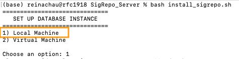
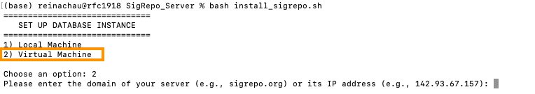
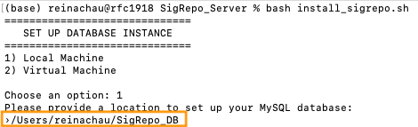
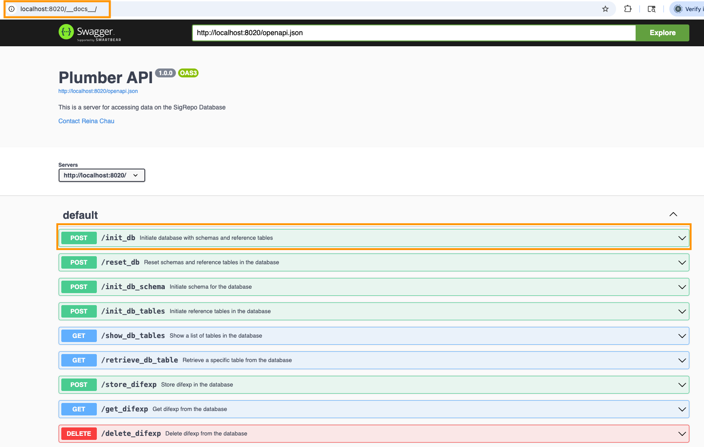
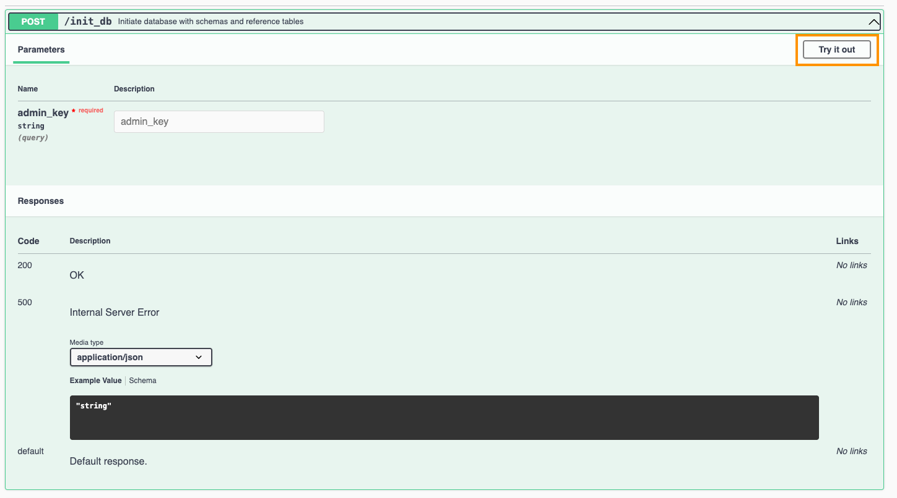
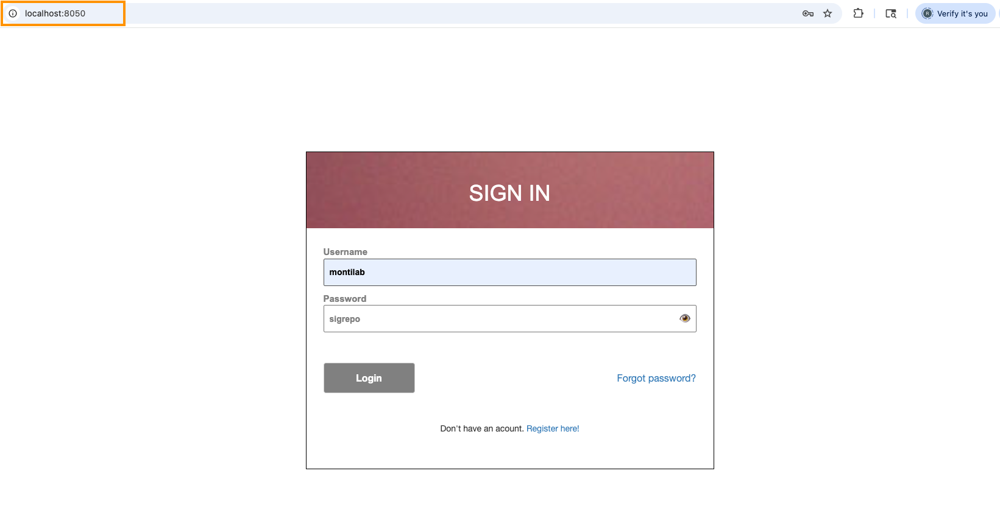

## Required OS

- MacOS
- Linux

## Software Requirements

- Git version >= 2.45.2
- Docker version >= 27.5.1
- Docker compose verson >= 2.32.4

Don't have Git installed, see [Git Guides](https://github.com/git-guides/install-git) on how to install Git on your OS

Don't have Docker installed, see [Docker Engine Guides](https://docs.docker.com/engine/install/) on how to set-up Docker that is compatible with your machine

Don't have Compose installed, see [Compose Plugin Guides](https://docs.docker.com/compose/install/) on how to install the plugin that is compatible with your machine

**NOTE:** You may need to restart your computer in order for Docker to kicks-in

- Check if Git is installed 

```bash
git version
```

- Check if Docker is installed 

```bash
docker version
```

- Check if Compose is installed

```bash
docker compose version
```

## Quick Install

1. Navigate to your `$HOME` directory

```
cd $HOME
```

2. Create a `SigRepo_DB` folder in your `$HOME` directory. This folder will be used to store the `SigRepo` database on your local machine.

```
mkdir SigRepo_DB
```

3. Clone `SigRepo_Server` repository to your `$HOME` directory

```
git clone https://github.com/montilab/SigRepo_Server
```

4. Navigate to `SigRepo_Server` folder

```
cd SigRepo_Server
```

5. Run `install_sigrepo.sh` to initialize the MySQL database instance, configure the API endpoints, and launch the Shiny Dashboard simultaneously.

```bash
bash install_sigrepo.sh
```

**Important Notes:**

- If you're installing `SigRepo` on your local machine, choose option (1) when prompted. If you’re installing it on a virtual machine, select option (2) instead.



- If you choose option (2), you’ll also need to enter the **public domain name** or **public IP address** of your server. 



-- To get the public domain name of your virtual machine. Try this simple command on your terminal. 

```
hostname -f
```

or 

-- To get a list of IP addresses on your virtual machine. Try this command.

```
hostname -I
```

**Note:** To determine if an IP address is **public** or **private**, check if it falls within the following private IP ranges (RFC 1918): 10.0.0.0–10.255.255.255, 172.16.0.0–172.31.255.255, or 192.168.0.0–192.168.255.255. If the IP address is within one of these ranges, it is a private IP address; otherwise, it is a public IP address.

- Next, when prompted for a location to set up the MySQL database, enter the **full path** to the **SigRepo_DB** directory you created in step (2).




- Once you’ve finished the rest of the installation steps without any issues, you should see an output similar to the following.

```
[+] Running 3/3
 ✔ Container sigrepo-mysql  Running                                                                                                                                                                                                                                       0.0s 
 ✔ Container sigrepo-api    Running                                                                                                                                                                                                                                       0.0s 
 ✔ Container sigrepo-shiny  Started                                                                                                                                                                                                                                       0.0s 

SigRepo setup is complete!
SigRepo MySQL database is currently deployed at port 3306
SigRepo API is currently deployed at localhost:8020/__docs__/
SigRepo Shiny is currently deployed at localhost:8050
```

6. Based on the output from the previous step (5), open your web browser of choice and navigate to `http://localhost:8020 /__docs__/` to verify that `SigRepo` API is successfully hosted.



**Important Notes:**

  - Based on the results from step (5), the **MySQL database** is deployed on **port 3306**, the **API** runs on **port 8020**, and the **Shiny Dashboard** is launched on **port 8050**. 
  
  - It's important to note that although the database is created during the initial setup, it starts out empty — there are no schema or data tables created at this stage. Therefore, running the API is the next important step as it builds the database structure and fills it with the required tables. Without this step, users will not be able to access or interact with the database, and the SigRepo Shiny Dashboard will fail to run properly.

  - Among the list of API endpoints available at `localhost:8020/__docs__/`, the **`init_db`** endpoint is specifically used to initialize the database with its schema and essential reference tables such as organisms, phenotypes, platforms, sample types, etc. 
  
  - To execute this endpoint, click the **“Try it out”** button in the API directive. This opens an interactive prompt where you can run the API directly. You will need to provide an **Admin Key** for authentication before execution.
  
  - If you’ve forgotten the **Admin Key** from step (5), you can retrieve it from the **.Renviron** file, where all environment variables are stored. This file is located in the **$HOME/SigRepo_DB** directory of your local machine.
  


7. After completing the database setup in step (6), open your preferred web browser and go to `http://localhost:8050` to confirm that the `SigRepo` Shiny dashboard is running as expected. 

**Note:** Try to login with default **username = "montilab"** and **password = "sigrepo"**



<br>

Any questions or issues? Please report them on our [github issues](https://github.com/montilab/SigRepo/issues).


