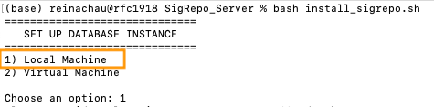
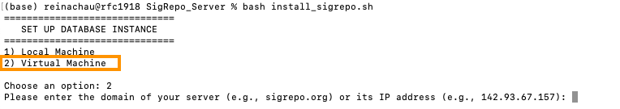
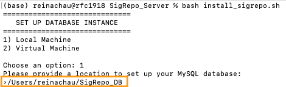
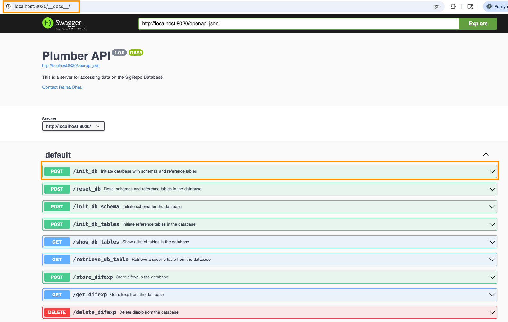
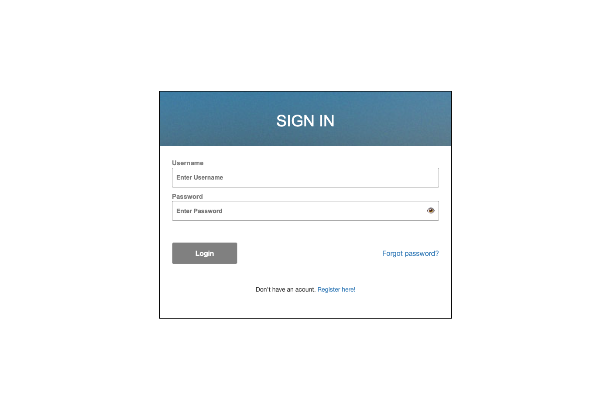

## Required OS

- MacOS
- Linux

## Software Requirements

- Git version >= 2.45.2
- Docker version >= 27.5.1
- Docker compose verson >= 2.32.4

Don't have Git installed, see [Git Guides](https://github.com/git-guides/install-git) on how to install Git on your OS

Don't have Docker installed, see [Docker Engine Guides](https://docs.docker.com/engine/install/) on how to set-up Docker that is compatible with your machine

Don't have Compose installed, see [Compose Plugin Guides](https://docs.docker.com/compose/install/) on how to install the plugin that is compatible with your machine

**NOTE:** You may need to restart your computer in order for Docker to kicks-in

- Check if Git is installed 

```bash
git version
```

- Check if Docker is installed 

```bash
docker version
```

- Check if Compose is installed

```bash
docker compose version
```

## Quick Install

1. Navigate to your `$HOME` directory

```
cd $HOME
```

2. Create a `SigRepo_DB` folder in your `$HOME` directory. This folder will be used to store the `SigRepo` database on your local machine.

```
mkdir SigRepo_DB
```

3. Clone `SigRepo_Server` repository to your `$HOME` directory

```
git clone https://github.com/montilab/SigRepo_Server
```

4. Navigate to `SigRepo_Server` folder

```
cd SigRepo_Server
```

5. Run `install_sigrepo.sh` to initialize the MySQL database instance, configure the API endpoints, build the database, and launch the R Shiny web interface.

```bash
bash install_sigrepo.sh
```

**Important Notes:**

- If you're installing `SigRepo` on your local machine, choose option (1) when prompted. If you’re installing it on a virtual machine, select option (2) instead.



- If you choose option (2), you’ll also need to enter the **public domain name** or **public IP address** of your server. 



-- To get the public domain name of your virtual machine. Try this simple command on your terminal. 

```
hostname -f
```

or 

-- To get a list of IP addresses on your virtual machine. Try this command.

```
hostname -I
```

**Note:** To determine if an IP address is **public** or **private**, check if it falls within the following private IP ranges (RFC 1918): 10.0.0.0–10.255.255.255, 172.16.0.0–172.31.255.255, or 192.168.0.0–192.168.255.255. If the IP address is within one of these ranges, it is a private IP address; otherwise, it is a public IP address.

- Next, when prompted for a location to set up the MySQL database, enter the **full path** to the **SigRepo_DB** directory you created in step (2).




- The script then asks for a MySQL root password and creates your **admin account** (username, email and password). This is the account you sign in to the web interface with; it is the only account on a new instance.

- The installer pulls the images, starts the MySQL database and the API, builds the database schema and reference tables (this takes several minutes), and finally starts the R Shiny web interface. When it finishes you should see output similar to the following. If a default port (3306, 8020 or 8051) is already in use on your machine, the installer picks a free port instead and prints it here.

```
==============================
   SIGREPO IS READY           
==============================

  Web interface    http://localhost:8051
  API docs         http://localhost:8020/__docs__/
  MySQL database   port 3306

Sign in as '<your admin username>' with the password you chose.
It is the only account on this instance, and it is an administrator.
```

6. Open your web browser and navigate to the **API docs** address printed in step (5), e.g. `http://localhost:8020/__docs__/`, to verify that the `SigRepo` API is running.



**Important Notes:**

  - The installer builds the database for you by calling the API's **`init_db`** endpoint, which creates the schema and loads reference tables such as organisms, phenotypes, platforms and sample types. You do not need to run it yourself.

  - If the installer reports that the database was not built, it prints the `curl` command to retry `init_db` and the command that starts the web interface afterwards. The **Admin Key** that command needs is stored in the **.Renviron** file in the database directory you chose in step (5), e.g. **$HOME/SigRepo_DB**.

7. Open the **Web interface** address printed in step (5), e.g. `http://localhost:8051`, to confirm that the `SigRepo` R Shiny app is running. Sign in with the admin account you created during installation.



<br>

Any questions or issues? Please report them on our [github issues](https://github.com/montilab/SigRepo/issues).


